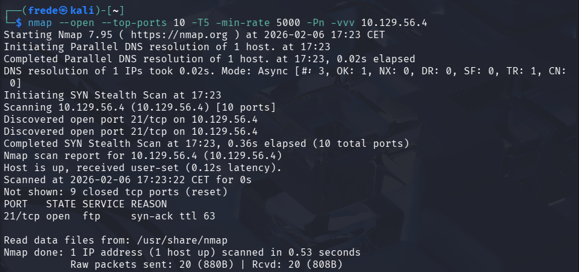
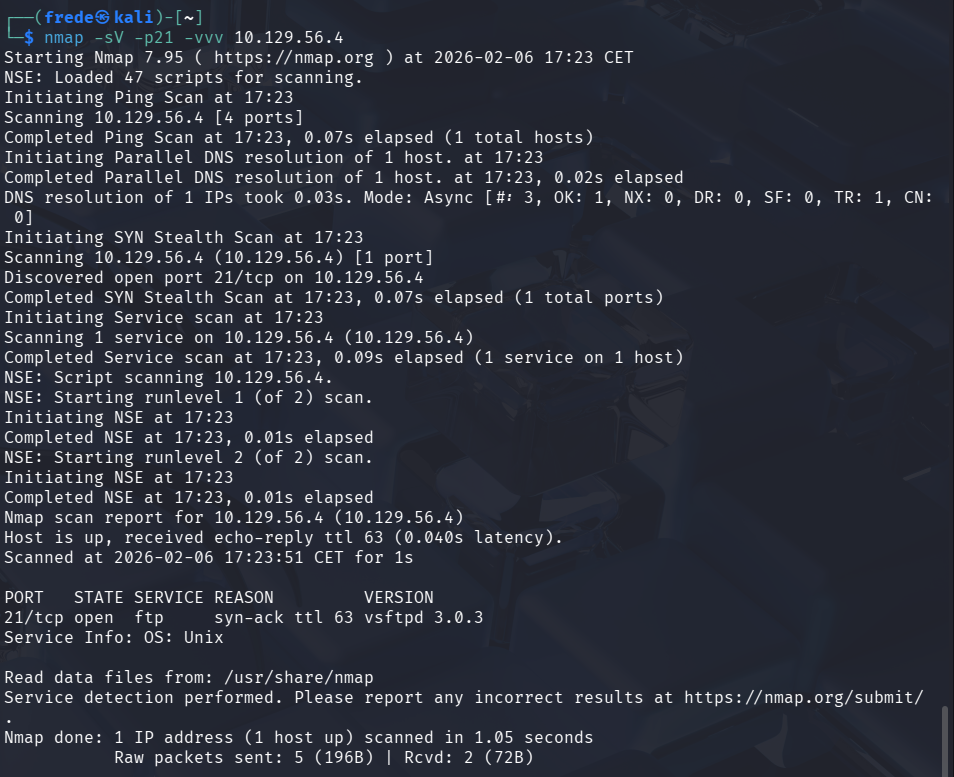
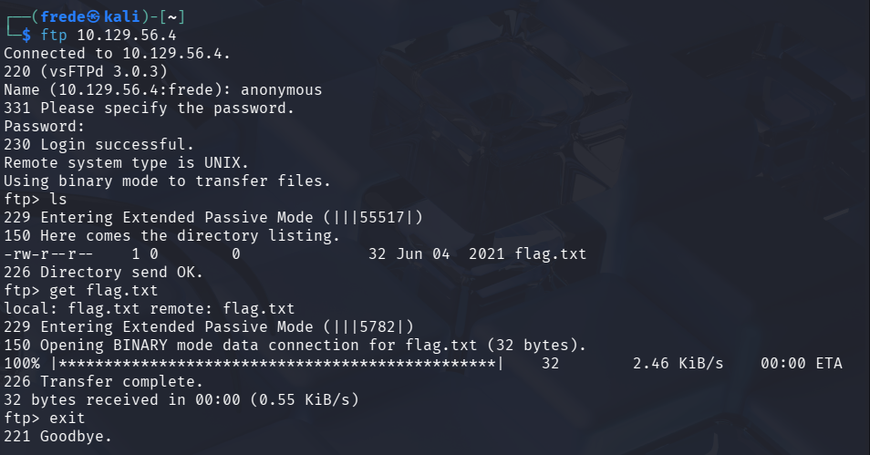
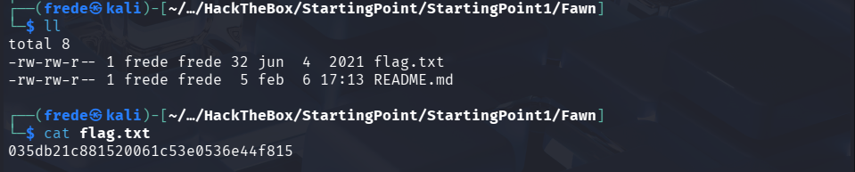

# FAWN

## 💻 Comprobación de conexión


Con el siguiente comando comprobamos si la máquina que atacamos está recibiendo señal trasmitiendo un paquete ICMP Echo Request,
recibiendo nosotros como atacantes un paquete ICMP Echo Reply confirmando la conexión con la máquina victima.

```bash
ping -c 1 10.129.56.4
```

## 🔎 Enumeración
### Paso 1


Con el siguiente comando utilizamos la herramienta **nmap** para enumerar los *10 puertos TCP más comunes*, mostrando únicamente aquellos que se encuentren abiertos.
Se establece una plantilla de temporización agresiva mediante el parámetro **-T5**, junto con **--min-rate 5000** para enviar al menos 5000 paquetes por segundo.
El parámetro **-Pn** se emplea para omitir la fase de descubrimiento de host (ping) y asumir que el objetivo está activo, mientras que **-vvv** aumenta el nivel de verbosidad, permitiendo observar en tiempo real el progreso y estado del escaneo.

```bash
nmap --open --top-ports 10 -T5 -min-rate 5000 -Pn -vvv 10.129.56.4
```
Como resultado del escaneo, se detectó el puerto 21/TCP abierto, correspondiente al servicio FTP, lo que indica que el servicio se encuentra activo en el sistema objetivo.

### Paso 2


Con el siguiente comando utilizamos nuevamente **nmap**, pero en esta caso para comprobar el tipo de version que usa el servicio **FTP** del puerto 21. Comprobamos que es una version **vsftpd 3.0.3**.

```bash
nmap -sV -p21 -vvv 10.129.56.4
```

## 🔓 Explotacion


Al comprobar que el puerto 21/TCP era el único abierto, se intentó el acceso al servicio FTP utilizando credenciales por defecto, resultando exitoso el inicio de sesión con el **usuario: anonymous** y la **contraseña: anonymous**.

Una vez dentro del servicio FTP, mediante el comando ls se listó el contenido del directorio, identificando el archivo flag.txt. Posteriormente, utilizando el comando get flag.txt, se descargó el archivo al directorio local.

## 🏁 Flag


Una vez dentro de del directorio local, mediante el comando cat flag.txt se muestra la flag.
